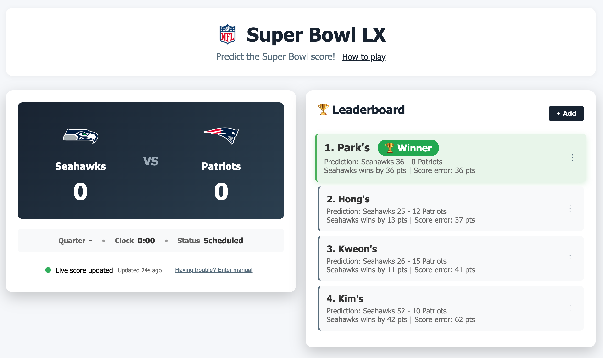

# 🏈 Super Bowl Score Prediction Game

A fun, family-friendly web application for predicting Super Bowl scores and competing with friends and family in real-time!

## 🎯 Overview

This interactive game lets you and your friends and family predict the final score of Super Bowl LX (Seattle Seahawks vs New England Patriots) and compete to see who gets closest to the actual result.

## 📸 Screenshot



## ✨ Features

### Core Functionality
- **Live Score Updates** - Automatic score updates every 60 seconds via ESPN API
- **Real-time Rankings** - Automatic leaderboard updates as scores change
- **Smart Scoring System** - Winner prediction first, then lowest score error
- **Auto/Manual Mode** - Easy toggle between automatic and manual score updates

### User Experience
- **Confetti Celebrations** 🎉 - Animated confetti when you take the lead
- **Smooth Animations** - Staggered list animations and transitions
- **Responsive Design** - Works perfectly on desktop, tablet, and mobile
- **Clean Minimal UI** - Professional, neutral color scheme with team logos
- **Empty State Design** - Friendly onboarding for first-time users
- **Intuitive Mode Toggle** - Easy switch between Auto and Manual modes

### Game Management
- **Add Predictions** - Simple modal form with name and score inputs
- **Edit & Delete** - Three-dot menu for managing predictions
- **Auto Winner Detection** - Automatically calculates winning team from scores
- **Persistent Storage** - Predictions saved in browser localStorage
- **Mode Toggle Button** - Intuitive text button to switch between Auto/Manual modes

### Information & Help
- **How to Play Modal** - Complete game rules and instructions
- **Team Information** - Official Seahawks and Patriots logos
- **Compact Game Info** - Single-line display (Quarter • Clock • Status)
- **Smart Display** - Hides redundant info when game is Live
- **Update Timestamp** - Shows how recent the data is (Auto mode only)

## 🚀 Quick Start

### Installation

No installation required! Just open the HTML file in any modern web browser:

```bash
# Clone the repository
git clone https://github.com/yourusername/superbowl-predictor.git

# Open the file
open superbowl-predictor.html
```

Or simply download `superbowl-predictor.html` and double-click to open.

### Usage

1. **Open the game** in your web browser
2. **Click "How to play"** to read the rules
3. **Add predictions** using the center button (empty state) or "+ Add" (with predictions)
4. **Watch the game** and see rankings update automatically
5. **Celebrate** when you take the lead! 🎊

## 🎮 How to Play

### Rules
1. **Predict the final score for both teams**
2. **1st Priority:** Predict the winning team correctly!
3. **2nd Priority:** Get closest to the actual scores (lowest score error)
4. Score error = `|Actual Seahawks - Predicted Seahawks| + |Actual Patriots - Predicted Patriots|`

### Example
```
Actual Score: Seahawks 28 - 24 Patriots (Seahawks win)

Prediction A: Seahawks 30 - 22 Patriots
→ Winner: Correct ✅
→ Score Error: |28-30| + |24-22| = 4 points
→ Final Score: 996 points

Prediction B: Patriots 27 - 25 Seahawks
→ Winner: Wrong ❌
→ Score Error: 6 points
→ Final Score: -12 points (negative!)

Result: Prediction A wins! Correct winner is most important.
```

### Winning
- **Most important:** Predict the correct winner
- **If tied:** Lower score error wins
- **If still tied:** Score error is the tiebreaker

## 🎯 Scoring Algorithm

```javascript
// If you predict the correct winner
score = 1000 - totalScoreError

// If you predict the wrong winner
score = 0 - (totalScoreError * 2)  // Negative score!
```

Where `totalScoreError = |Actual Seahawks - Predicted Seahawks| + |Actual Patriots - Predicted Patriots|`

**Key Points:**
- Predicting the correct winner is essential (gets you positive score)
- Wrong winner prediction = automatic negative score
- Among correct winner predictions, closest to actual scores wins
- Simple, intuitive, and fair!

## 🛠️ Technical Details

### Built With
- **HTML5** - Structure
- **CSS3** - Styling and animations
- **Vanilla JavaScript** - Logic and interactivity
- **ESPN API** - Live score data
- **Canvas Confetti** - Celebration effects
- **LocalStorage** - Data persistence

### Browser Support
- Chrome (recommended)
- Firefox
- Safari
- Edge
- Any modern browser with ES6+ support

### API Integration
- Uses ESPN's public NFL scoreboard API
- Updates every 60 seconds
- Automatic retry on failure
- Manual fallback available

## 📱 Features in Detail

### Live Score System
- Fetches from ESPN API every 60 seconds in Auto mode
- Pauses updates when prediction modal is open
- Single-line game info display (Quarter • Clock • Status)
- Hides Status indicator when game is Live (redundant with Quarter/Clock)
- Easy toggle to Manual mode if API has issues
- API status indicator (🟢 success, 🟡 loading, 🔴 error)

### Leaderboard
- Auto-sorts by winner prediction first, then score error
- Correct winner predictions show ✅, incorrect show ❌
- Winner highlighted with green background
- Slightly larger font for 1st place
- Smooth animations when rankings change
- Shows predicted winner, score difference, and total error
- Hides checkmarks when actual game is a Tie

### Predictions
- Quick add via modal form
- Auto-calculates winning team from scores
- Edit and delete via three-dot menu
- Confirmation dialog before deletion
- Persists across browser sessions

### Animations
- Confetti celebration on leader change
- Staggered slide-in for list items
- Smooth transitions on all interactions
- Floating icon in empty state
- Hover effects on all interactive elements

## 🎨 Design Philosophy

- **Minimal & Clean** - Neutral color palette
- **Sports Authentic** - Official team logos and NFL branding
- **User-Friendly** - Clear CTAs and intuitive navigation
- **Mobile-First** - Responsive grid layout
- **Accessible** - High contrast and readable fonts

## 📂 Project Structure

```
.
├── superbowl-predictor.html    # Single-file application
└── README.md                    # This file
```

## 🤝 Contributing

This is a family game project, but feel free to fork and customize for your own use!

## 📄 License

This project is open source and available under the MIT License.

## 🎉 Credits

- **NFL & ESPN** - Team logos and live score API
- **Canvas Confetti** - Confetti celebration library
- **Built with** ❤️ for Super Bowl LX

## 📞 Support

For questions or issues:
1. Check the "How to play" modal in the app
2. Use manual score input if API fails
3. Clear browser localStorage to reset

---

**Game Day:** February 8, 2026 at 6:30 PM EST
**Matchup:** Seattle Seahawks vs New England Patriots
**Location:** Levi's Stadium, Santa Clara, CA

Enjoy the game! 🏈🎉
